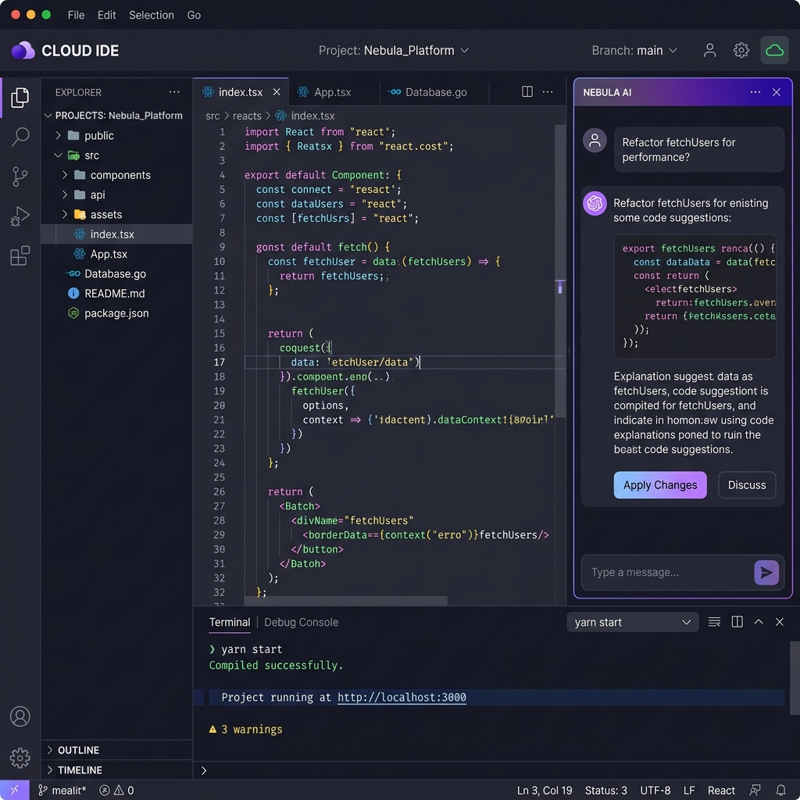
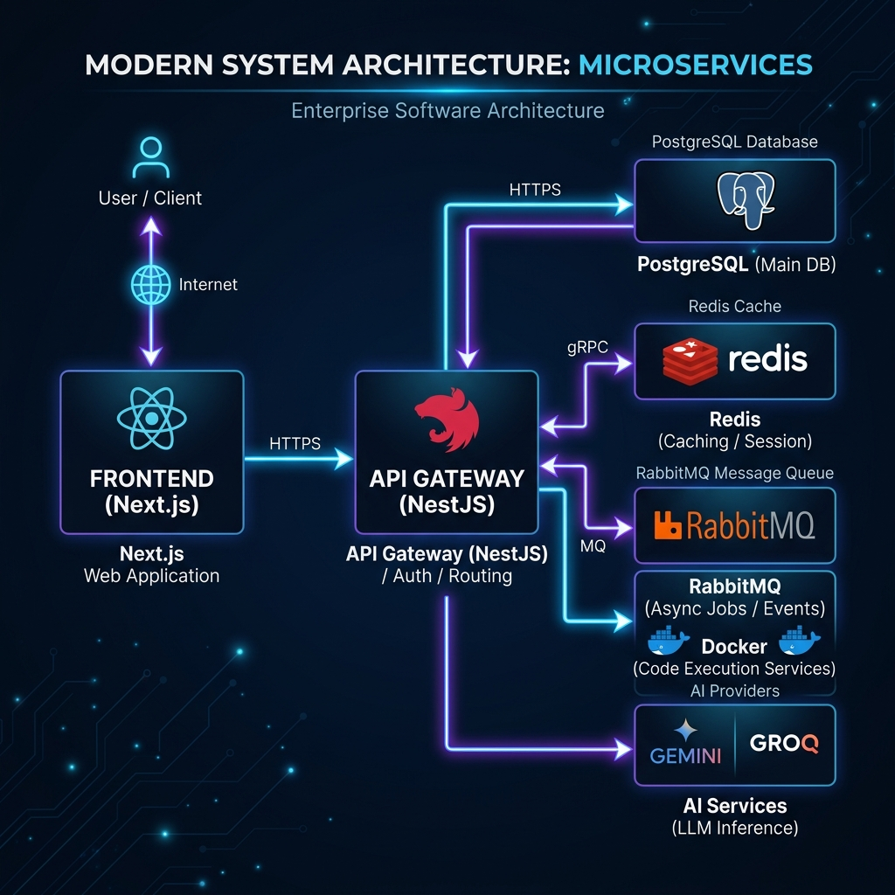
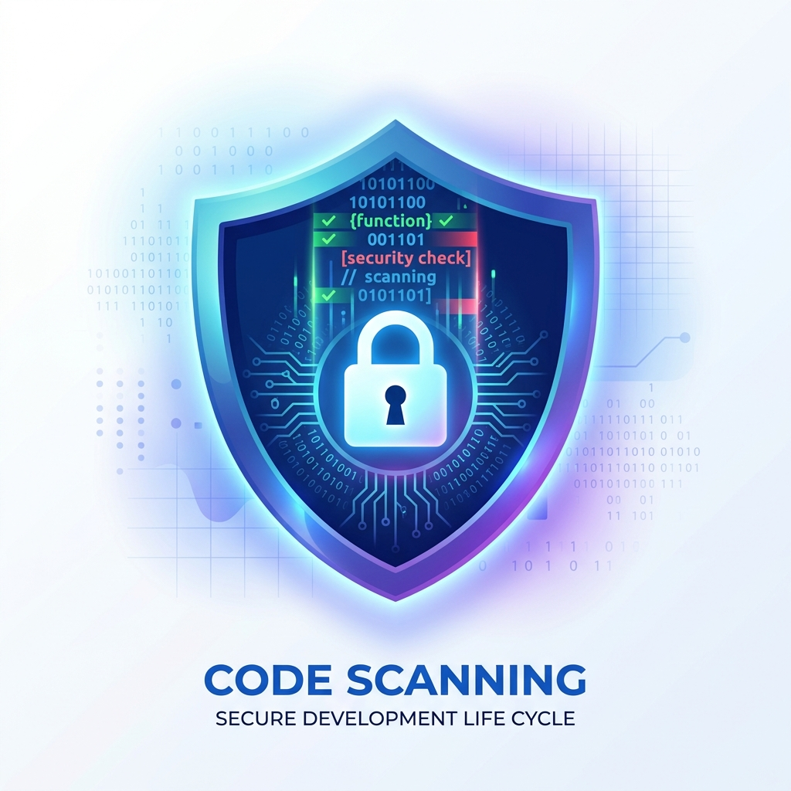
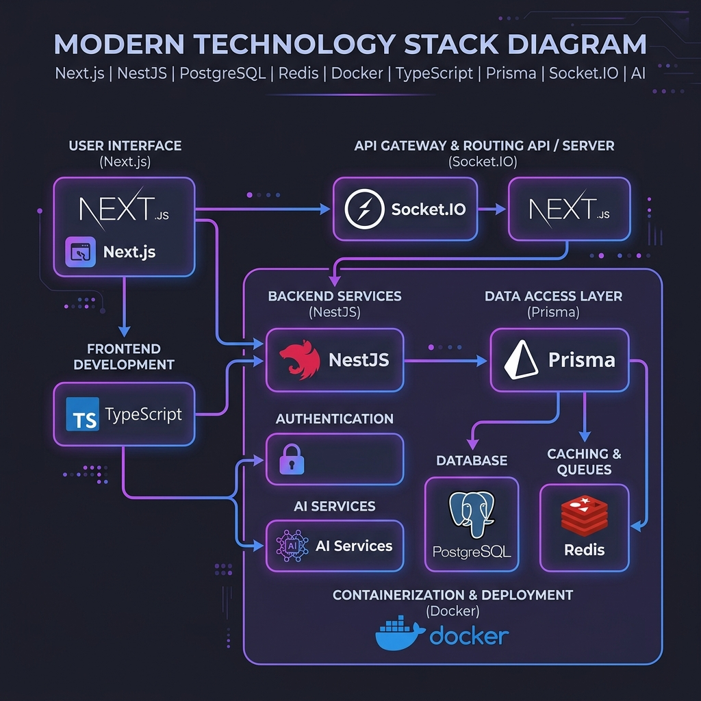

# CodeForge — AI-Powered Realtime Collaborative Cloud IDE

<div align="center">

[](https://github.com/hmudgal577-svg/codeforge)
[](https://www.typescriptlang.org/)
[](https://nextjs.org/)
[](https://nestjs.com/)
[](https://www.docker.com/)
[](https://kubernetes.io/)

**A production-grade, highly scalable cloud IDE featuring real-time peer collaboration, secure sandboxed code execution, and autonomous AI-assisted software engineering.**

<br/>



<br/>

[Explore Architecture](#-architecture) • [Monorepo Layout](#-monorepo-structure) • [Tech Stack](#-tech-stack) • [Quick Start](#-quick-start) • [Security Model](#-security)

</div>

---

## 🏗️ Architecture

CodeForge utilizes a distributed, event-driven microservices architecture built around a high-performance monorepo. Real-time collaboration is powered by custom Yjs CRDT synchronization over WebSockets, while code execution is isolated within sandboxed Docker runtimes orchestrated dynamically.

<div align="center">
  
</div>

```
┌────────────────────────────────────────────────────────────────────────┐
│                        NEXT.JS 15 WEB FRONTEND                         │
│             (Monaco Editor + Yjs CRDTs + Zustand + Socket.IO)          │
└────────────────────────────────────────────────────────────────────────┘
                                   │
                                   ▼
┌────────────────────────────────────────────────────────────────────────┐
│                          NGINX REVERSE PROXY                           │
│             (Load Balancing + SSL Termination + Rate Limiting)         │
└────────────────────────────────────────────────────────────────────────┘
                                   │
                                   ▼
┌────────────────────────────────────────────────────────────────────────┐
│                         NESTJS API GATEWAY                             │
│     (REST Endpoint Routes + WS Gateway Sessions + Request Validation)  │
└────────────────────────────────────────────────────────────────────────┘
            │                                              │
            ▼ (Redis Streams Event Bus)                    ▼ (BullMQ / RabbitMQ)
┌──────────────────────────────────────┐        ┌────────────────────────┐
│           DISTRIBUTED MESH           │        │   EXECUTION WORKERS    │
│  ┌────────────────────────────────┐  │        │  ┌──────────────────┐  │
│  │   security-service (Threats)   │  │        │  │ Node.js Sandbox  │  │
│  └────────────────────────────────┘  │        │  └──────────────────┘  │
│  ┌────────────────────────────────┐  │        │  ┌──────────────────┐  │
│  │   execution-orchestrator       │  │        │  │ Python Sandbox   │  │
│  └────────────────────────────────┘  │        │  └──────────────────┘  │
│  ┌────────────────────────────────┐  │        │  ┌──────────────────┐  │
│  │   ai-worker (Code Analysis)    │  │        │  │ C++ / Java Box   │  │
│  └────────────────────────────────┘  │        │  └──────────────────┘  │
└──────────────────────────────────────┘        └────────────────────────┘
```

---

## 📁 Monorepo Structure

CodeForge is structured as a Turborepo monorepo to maintain strict boundaries between core application gateways, background worker daemons, and reusable package libraries.

```
codeforge/
├── apps/
│   ├── web/                     → Next.js 15 frontend featuring Monaco, Yjs synchronization, and Tailwind CSS.
│   └── api-gateway/             → NestJS API gateway orchestration hub managing authentication, DB, and WebSockets.
├── services/
│   ├── execution-worker/        → Sandboxed Docker container runners triggered via BullMQ execution jobs.
│   ├── execution-orchestrator/  → Distributed service registry managing container lifecycle and runtime nodes.
│   ├── ai-worker/               → Background worker for executing automated LLM-based code audits and edits.
│   └── security-service/        → Real-time event monitor sniffing threat vectors and resource violations.
├── packages/
│   ├── crdt-sync/               → Core custom binary delta synchronization using Yjs state vectors and recovery.
│   ├── distributed-fs/          → CRDT-backed file tree manager with snapshotting and merge-conflict resolution.
│   ├── auto-recovery/           → Autonomic healing infrastructure detecting and repairing disconnected sessions.
│   ├── event-bus/               → Event publisher/subscriber layer built on top of high-performance Redis Streams.
│   ├── observability/           → Metrics dashboard telemetry via Prometheus and distributed OpenTelemetry traces.
│   ├── config/                  → Unified configuration linting rules and TypeScript compiler parameters.
│   └── shared-types/            → Shared schemas and TypeScript interfaces utilized across all components.
├── docker/
│   └── runtimes/                → Hardened container configuration files for Python, Node, C++, and Java execution.
├── k8s/                         → Kubernetes production deployment manifests (Ingress, Gateway, Workers, Redis).
├── monitoring/                  → Grafana dashboards, Prometheus configs, and Loki log aggregator rules.
└── CodeForge-PPT/               → CodeForge architecture project documentation and slides.
```

---

## ⚡ Key Technical Packages & Services

### 🔄 Custom CRDT Sync Engine (`@codeforge/crdt-sync`)
* **State Vectors**: Optimizes bandwidth usage by transmitting compact Yjs binary state vectors to determine missing state deltas.
* **Delta Synchronization**: Sends incremental binary diffs across WebSockets instead of full text files.
* **Cursor Compression**: Employs structural mapping keys to compress cursor updates by ~70%, decreasing network overhead.
* **Event Replay**: Records sequential document logs to offer timeline scrubbing and playback features.

<div align="center">
  
</div>

### 🗄️ Distributed Collaborative Filesystem (`@codeforge/distributed-fs`)
* **Conflict-Free Tree Merges**: Computes non-overlapping file additions, edits, and deletions dynamically.
* **FS Snapshot Persistence**: Saves filesystem states to Redis with automated version history tracking.
* **Local Delta Capture**: Records changes (move, rename, modify) as isolated delta operations to allow multi-device offline workspace recovery.

### 🛡️ Security Isolation Layer (`@codeforge/security-service` & Execution Workers)
* **Sandboxed Container Runtime**: Executes code within scratch Docker runtimes with strictly bounded system capacities.
* **Process Safeguards**: Blocks host network access, locks down root capabilities, caps PID pools, and sets strict RAM/CPU ceilings.
* **Intelligent Threat Auditing**: Screens input code strings for malicious patterns (e.g. fork bombs, disk fill scripts) prior to dispatching.

---

## 🔒 Security Architecture

<div align="center">
  
</div>

| Layer | Component | Security Protections Implemented |
|---|---|---|
| **Identity** | Gateway Auth | Double JWT (Access + Rotate Refresh) + HTTP-only cookies + bcrypt password hashing. |
| **API Boundary** | Express Gateway | Strict CORS validation, Helmet headers, IP-based API rate limiting. |
| **Realtime** | WebSocket Socket.IO | Strict handshake JWT validation, client-level messaging limits to prevent socket floods. |
| **Compute Sandbox** | Docker Runtimes | Read-only root FS, dropped Linux capabilities, network isolation, 60s execution timeouts, strict Memory Limits. |
| **Persistence** | Prisma Client | Type-safe parameterized queries preventing SQL injection, strict Role-Based Access Control (RBAC). |

---

## 🛠️ Tech Stack

<div align="center">
  
</div>

* **Frontend Framework**: Next.js 15 (App Router), React, Tailwind CSS, Framer Motion
* **Text Editing**: Monaco Editor with custom Yjs bindings (`y-monaco`)
* **State Management**: Zustand
* **API Backend**: NestJS (v10), Prisma ORM
* **Databases**: PostgreSQL (Main DB), Redis (Caching, Socket Sessions, Event Streams)
* **Job Queues**: BullMQ (Node.js queues), RabbitMQ (Enterprise events)
* **Containerization**: Docker, Docker Compose, Kubernetes
* **Monitoring**: Prometheus, Grafana, OpenTelemetry, Grafana Loki

---

## 🚀 Quick Start

Follow these steps to run CodeForge on your local machine.

### Prerequisites
* [Node.js](https://nodejs.org/) (v20 or higher)
* [NPM](https://www.npmjs.com/) (v10 or higher)
* [Docker](https://www.docker.com/) & Docker Compose

### 1. Project Initialization & Setup
Clone this repository and copy the environment configuration:
```bash
git clone https://github.com/hmudgal577-svg/codeforge.git
cd codeforge
cp .env.example .env
```

### 2. Launch Local Infrastructure
Spins up PostgreSQL, Redis, RabbitMQ, and the observability monitoring stack:
```bash
docker compose up -d
```

### 3. Install Monorepo Dependencies
Install all package and service dependencies at the monorepo root:
```bash
npm install
```

### 4. Database Initialization
Run database schema generation and push migrations to PostgreSQL:
```bash
npm run db:generate
npm run db:push
```

### 5. Build Hardened Execution Runtimes
Build the isolated Docker containers used by the execution worker:
```bash
docker build -t codeforge-runtime-python ./docker/runtimes/python
docker build -t codeforge-runtime-node ./docker/runtimes/node
docker build -t codeforge-runtime-cpp ./docker/runtimes/cpp
docker build -t codeforge-runtime-java ./docker/runtimes/java
```

### 6. Spin Up Services in Development Mode
Launch all monorepo gateways and workers concurrently using Turborepo:
```bash
npm run dev
```
Alternatively, run components individually:
* **NestJS Gateway**: `cd apps/api-gateway && npm run dev` (Runs on Port `4000`)
* **Next.js Web**: `cd apps/web && npm run dev` (Runs on Port `3000`)

---

## 📈 Monitoring & API Documentation

* **Swagger API Reference**: Once the API Gateway is online, view the REST docs at `http://localhost:4000/api/docs`
* **Prometheus Metrics**: Metrics are exposed at `http://localhost:4000/metrics`
* **Grafana Dashboards**: Access visual monitoring graphs at `http://localhost:3000` (or configured Grafana port)

---

## 📜 License

This project is licensed under the MIT License.
